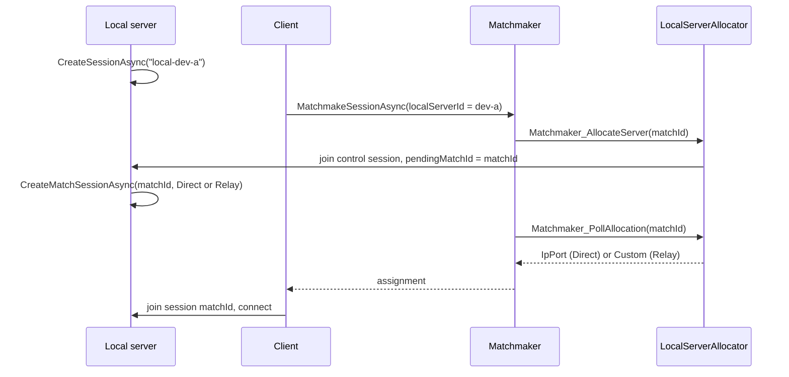

# Local server allocator configuration

> **Interim workaround.** This allocator lets the matchmaker hand players a server running on your own machine,
> for development and testing. It works around current limitations of Cloud Code hosting and may change as Cloud
> Code hosting evolves. It is not intended for production hosting.

With Cloud Code hosting, the matchmaker calls a Cloud Code module to find a server for each match. The other
modules in this repository ask a hosting provider to start one. This module points matched players at a server
you already started yourself, either on the same machine or LAN (direct connection) or anywhere through Relay.

## Required secrets

No secrets required. The module uses the Cloud Code service token.

## Required code changes

None. The optional constants in `Project/LocalServerAllocator.cs` and `Project/LocalServerIds.cs` must match the
server code below if you change them:

- `LocalServerAllocator.AllocatorPlayerId` (`LocalServerAllocator00000000`) — the player the module joins the control
  session as.
- `LocalServerAllocator.PendingMatchIdKey` (`pendingMatchId`) — the player data key carrying the match id.
- `LocalServerIds.PlayerPropertyKey` (`localServerId`) — the matchmaker player property that picks the server.
- `LocalServerIds.ControlSessionPrefix` (`local-`) — the prefix of the server's control session id.

## Why a local server needs this

When `MultiplayerService.Instance.MatchmakeSessionAsync` receives an assignment, the client joins the session
**whose id is the match id**, and it does not retry if that session doesn't exist yet. A hosting provider starts a
fresh server for every match, so that server knows the match id from the start and creates its session under it.
A server on your machine is already running before any match exists, so something has to tell it the match id,
and the allocation must not be reported ready until the server has created that session.

## How it works

1. **The server** signs in with a service account and creates a *control session* with the id
   `local-<localServerId>`, for example `local-dev-a`. It then watches that session's players.
2. **The client** calls `MatchmakeSessionAsync` with the player property `localServerId`.
3. **The matchmaker** forms a match from tickets with the same `localServerId` and calls the module's
   `Matchmaker_AllocateServer`.
4. **Allocate** joins the control session as the player `LocalServerAllocator00000000` and writes the match id into
   that player's own data (`pendingMatchId`). On later matches it updates that data instead of joining again.
5. **The server** sees `pendingMatchId` change and creates the match session with
   `MultiplayerServerService.Instance.CreateMatchSessionAsync(matchId, …)` — the same call a per-match dedicated
   server makes — on a direct network or on Relay.
6. **Poll** (`Matchmaker_PollAllocation`) looks up the session with the match id. It returns *pending* until the
   session exists and has published its network. Then it returns an IP/port assignment for a direct network, or a
   custom assignment for Relay.
7. **The client** joins the match session, which now exists, and connects the way the session says: directly, or
   through Relay.



## Queue configuration

`LocalServerQueue.mmq` is a ready-to-deploy queue named `local-server`:

- `matchHosting` uses `CloudCode` with this module and its two functions:

  ```json
  "matchHosting": {
    "type": "CloudCode",
    "moduleName": "LocalServerAllocator",
    "allocateFunctionName": "Matchmaker_AllocateServer",
    "pollFunctionName": "Matchmaker_PollAllocation"
  }
  ```

- The `SameServer` Equality rule on `Players.CustomData.localServerId` only matches players who target the same
  server, so several developers can share one project and environment, each with their own server id.
- A match is one team of one player, which is the quickest to test. To test with more players, raise
  `playerCount` in the pool, and raise `MaxPlayers` in the server and client code below to at least the pool's
  maximum player count.

## Server (Unity)

The server needs the Multiplayer Services package (`com.unity.services.multiplayer` 2.1.0 or later) and a
`NetworkManager` in the scene; the session starts your netcode for you once it has a network. The server APIs
only compile in the Editor and in server builds (`UNITY_SERVER`). Run it in Play Mode with a Server build profile
active, or as a server build.

Keep the service account out of source control. This example reads it from environment variables, which is enough
for local testing but isn't a recommendation for managing secrets; use your team's secret store where you have
one. Set the variables before you start the Editor or the server build.

```csharp
#if UNITY_EDITOR || UNITY_SERVER
using System;
using System.Linq;
using System.Threading.Tasks;
using Unity.Services.Authentication.Server;
using Unity.Services.Core;
using Unity.Services.Multiplayer;
using UnityEngine;

public class ServerBootstrap : MonoBehaviour
{
    // Must match the module's constants.
    const string AllocatorPlayerId = "LocalServerAllocator00000000";
    const string PendingMatchIdKey = "pendingMatchId";
    const string ControlSessionPrefix = "local-";

    // Environment variables keep the credentials out of source control for local testing only; they are not the
    // suggested way to handle secrets. Load them from your secret store if you have one.
    const string ServiceAccountKeyIdVariable = "LOCAL_SERVER_SERVICE_ACCOUNT_KEY_ID";
    const string ServiceAccountSecretVariable = "LOCAL_SERVER_SERVICE_ACCOUNT_SECRET";

    [SerializeField] string m_LocalServerId = "dev-a";
    [SerializeField] bool m_UseRelay;
    [Tooltip("At least the queue pool's maximum player count.")]
    [SerializeField] int m_MaxPlayers = 1;

    IServerSession m_ControlSession;
    IServerSession m_MatchSession;
    string m_LastHandledMatchId;

    async void Start()
    {
        try
        {
            await UnityServices.InitializeAsync();
            await ServerAuthenticationService.Instance.SignInWithServiceAccountAsync(
                Environment.GetEnvironmentVariable(ServiceAccountKeyIdVariable),
                Environment.GetEnvironmentVariable(ServiceAccountSecretVariable));

            // The control session only carries the match id, so it needs no network.
            m_ControlSession = await MultiplayerServerService.Instance.CreateSessionAsync(
                ControlSessionPrefix + m_LocalServerId,
                new SessionOptions { Name = ControlSessionPrefix + m_LocalServerId, IsPrivate = true, MaxPlayers = 2 });

            // The allocator joins once, then updates its player data for every later match.
            m_ControlSession.PlayerJoined += _ => OnControlSessionChanged();
            m_ControlSession.PlayerPropertiesChanged += OnControlSessionChanged;
            Debug.Log($"Control session '{m_ControlSession.Id}' ready.");
        }
        catch (Exception e)
        {
            Debug.LogException(Unwrap(e));
        }
    }

    void OnControlSessionChanged() => _ = CreatePendingMatchSessionAsync();

    async Task CreatePendingMatchSessionAsync()
    {
        var allocator = m_ControlSession.Players.FirstOrDefault(player => player.Id == AllocatorPlayerId);
        if (allocator == null ||
            !allocator.Properties.TryGetValue(PendingMatchIdKey, out var pendingMatchId) ||
            string.IsNullOrEmpty(pendingMatchId.Value) ||
            pendingMatchId.Value == m_LastHandledMatchId)
        {
            return;
        }

        var matchId = pendingMatchId.Value;
        m_LastHandledMatchId = matchId;

        try
        {
            // One NetworkManager runs one match at a time, so the next match replaces the current one.
            if (m_MatchSession != null)
            {
                var previousMatchSession = m_MatchSession;
                m_MatchSession = null;
                await previousMatchSession.DeleteAsync();
            }

            // Don't set the same SessionOptions.Type as the control session: the SDK keeps one session per type.
            var options = new SessionOptions { MaxPlayers = m_MaxPlayers };
            options = m_UseRelay ? options.WithRelayNetwork() : options.WithDirectNetwork();

            m_MatchSession = await MultiplayerServerService.Instance.CreateMatchSessionAsync(matchId, options);
            m_MatchSession.PlayerJoined += playerId => Debug.Log($"Player joined match {matchId}: {playerId}");
            Debug.Log($"Match session '{m_MatchSession.Id}' created ({(m_UseRelay ? "Relay" : "Direct")}).");
        }
        catch (Exception e)
        {
            Debug.LogException(Unwrap(e));
        }
    }

    // The server session APIs surface failures wrapped in AggregateException.
    static Exception Unwrap(Exception exception) =>
        exception is AggregateException aggregate ? aggregate.Flatten().InnerException ?? exception : exception;
}
#endif
```

`WithDirectNetwork()` listens on and publishes `127.0.0.1`, so clients must be on the same machine. For clients on
your LAN, use `WithDirectNetwork("0.0.0.0", "<your LAN IP>", <port>)`. For clients anywhere, set `m_UseRelay`.

The service account needs permission to use Lobby, Relay and Matchmaker in the project. Create it in the
[Unity Dashboard](https://cloud.unity.com) under **Administration** > **Service Accounts**.

## Client (Unity)

```csharp
using System.Collections.Generic;
using Unity.Services.Authentication;
using Unity.Services.Core;
using Unity.Services.Multiplayer;
using UnityEngine;

public class ClientBootstrap : MonoBehaviour
{
    const string QueueName = "local-server";
    const string LocalServerIdProperty = "localServerId";

    [SerializeField] string m_LocalServerId = "dev-a";
    [Tooltip("The queue pool's maximum player count.")]
    [SerializeField] int m_MaxPlayers = 1;

    async void Start()
    {
        try
        {
            await UnityServices.InitializeAsync();
            if (!AuthenticationService.Instance.IsSignedIn)
                await AuthenticationService.Instance.SignInAnonymouslyAsync();

            var matchmakerOptions = new MatchmakerOptions
            {
                QueueName = QueueName,
                PlayerProperties = new Dictionary<string, PlayerProperty>
                {
                    [LocalServerIdProperty] = new PlayerProperty(m_LocalServerId)
                }
            };

            var session = await MultiplayerService.Instance.MatchmakeSessionAsync(
                matchmakerOptions, new SessionOptions { MaxPlayers = m_MaxPlayers });
            Debug.Log($"Matched. Joined session '{session.Id}'.");
        }
        catch (SessionException e)
        {
            Debug.LogError($"Matchmaking failed ({e.Error}): {e.Message}");
        }
    }
}
```

## Player-hosted variant (no service account)

The module only cares that something creates the control session and then hosts a session under each match id. A
regular **player** can do that instead of a dedicated server: it signs in anonymously, so you need no service account
and no server build. Run it as a second Multiplayer Play Mode player next to your client.

What changes compared with the server:

- The host is a **player in the match session**. It takes a slot, shows up in the session's players, and your netcode
  runs as a host (with its own player object) rather than as a dedicated server. Set the host's `MaxPlayers` to the
  pool's maximum player count **plus one**.
- It exercises the matchmaker-to-host flow, not the server APIs (`MultiplayerServerService`,
  `CreateMatchSessionAsync`). The session is not created with the match's matchmaking results, so don't use this
  variant for backfill.
- The host creates both sessions with `MultiplayerService.Instance.CreateOrJoinSessionAsync(id, options)`, the
  player-side call that takes a session id. The control session needs its own `SessionOptions.Type`, because the
  SDK keeps one session per type.

```csharp
using System;
using System.Linq;
using System.Threading.Tasks;
using Unity.Services.Authentication;
using Unity.Services.Core;
using Unity.Services.Multiplayer;
using UnityEngine;

public class HostBootstrap : MonoBehaviour
{
    // Must match the module's constants.
    const string AllocatorPlayerId = "LocalServerAllocator00000000";
    const string PendingMatchIdKey = "pendingMatchId";
    const string ControlSessionPrefix = "local-";

    // The SDK keeps one session per type, so the control session can't share the match session's type.
    const string ControlSessionType = "LocalServerControl";

    [SerializeField] string m_LocalServerId = "dev-a";
    [SerializeField] bool m_UseRelay;
    [Tooltip("The queue pool's maximum player count, plus one for this host.")]
    [SerializeField] int m_MaxPlayers = 2;

    ISession m_ControlSession;
    ISession m_MatchSession;
    string m_LastHandledMatchId;

    async void Start()
    {
        try
        {
            await UnityServices.InitializeAsync();
            if (!AuthenticationService.Instance.IsSignedIn)
                await AuthenticationService.Instance.SignInAnonymouslyAsync();

            var controlSessionId = ControlSessionPrefix + m_LocalServerId;
            m_ControlSession = await MultiplayerService.Instance.CreateOrJoinSessionAsync(controlSessionId,
                new SessionOptions { Name = controlSessionId, Type = ControlSessionType, IsPrivate = true, MaxPlayers = 2 });

            // The allocator joins once, then updates its player data for every later match.
            m_ControlSession.PlayerJoined += _ => OnControlSessionChanged();
            m_ControlSession.PlayerPropertiesChanged += OnControlSessionChanged;
            Debug.Log($"Control session '{m_ControlSession.Id}' ready.");
        }
        catch (Exception e)
        {
            Debug.LogException(e);
        }
    }

    void OnControlSessionChanged() => _ = CreatePendingMatchSessionAsync();

    async Task CreatePendingMatchSessionAsync()
    {
        var allocator = m_ControlSession.Players.FirstOrDefault(player => player.Id == AllocatorPlayerId);
        if (allocator == null ||
            !allocator.Properties.TryGetValue(PendingMatchIdKey, out var pendingMatchId) ||
            string.IsNullOrEmpty(pendingMatchId.Value) ||
            pendingMatchId.Value == m_LastHandledMatchId)
        {
            return;
        }

        var matchId = pendingMatchId.Value;
        m_LastHandledMatchId = matchId;

        try
        {
            // One NetworkManager runs one match at a time, so the next match replaces the current one.
            if (m_MatchSession != null)
            {
                var previousMatchSession = m_MatchSession;
                m_MatchSession = null;
                await previousMatchSession.AsHost().DeleteAsync();
            }

            var options = new SessionOptions { MaxPlayers = m_MaxPlayers };
            options = m_UseRelay ? options.WithRelayNetwork() : options.WithDirectNetwork();

            m_MatchSession = await MultiplayerService.Instance.CreateOrJoinSessionAsync(matchId, options);
            m_MatchSession.PlayerJoined += playerId => Debug.Log($"Player joined match {matchId}: {playerId}");
            Debug.Log($"Match session '{m_MatchSession.Id}' hosted ({(m_UseRelay ? "Relay" : "Direct")}).");
        }
        catch (Exception e)
        {
            Debug.LogException(e);
        }
    }
}
```

The client is the same as above.

### Run with Multiplayer Play Mode

1. Install Multiplayer Play Mode (`com.unity.multiplayer.playmode`), open **Window** > **Multiplayer** >
   **Multiplayer Play Mode**, and activate one additional player.
2. Create a `Host` tag and give it to that player.
3. Pick the role at startup, for example from one bootstrap object:

   ```csharp
   if (Unity.Multiplayer.PlayMode.CurrentPlayer.ReadOnlyTags().Contains("Host"))
       gameObject.AddComponent<HostBootstrap>();
   else
       gameObject.AddComponent<ClientBootstrap>();
   ```

4. Enter Play Mode. Wait for `Control session 'local-dev-a' ready.` on the host before the client matchmakes.

The host and the client must sign in as **different** players. If they end up with the same player id, give the host
its own authentication profile before signing in.

## Deploy and run

1. Deploy the module and the queue, with the UGS CLI or the Unity Editor as described in the
   [README](../../README.md#deploy-the-module). In the Editor, add a Cloud Code C# Module Reference pointing at
   `LocalServerAllocator.sln`, and add `LocalServerQueue.mmq` to your project's deployment assets.
2. Start the server: set the service account environment variables, make a Server build profile active and enter
   Play Mode, or run a server build. Wait for `Control session 'local-dev-a' ready.`
3. Start a client as a separate process — a Player build, or a Multiplayer Play Mode instance — with the same
   `localServerId`.

## Limitations

- **Restarting after a crash.** If the server process is killed rather than shut down, its control session is
  left behind for a while, and a new server with the same `localServerId` fails with "A Session with the same
  identifier already exists". Stop the server cleanly (exit Play Mode or quit the build), or wait a few minutes
  for the old session to expire, or start with a different `localServerId`.
- **One match per server at a time.** A Unity process has one `NetworkManager`, so the server above ends the
  current match session when the next match is allocated, and its players are disconnected. `pendingMatchId` is a
  single value too, so a match allocated before the server has picked up the previous one replaces it. Give each
  server its own `localServerId`, and run several servers to host several matches at once.
- **Relies on an internal format.** Poll reads the session's network from the `_session_network` session data
  that the Multiplayer Services SDK writes. If that format changes, the module has to follow.
- **Direct connections need a reachable address.** Direct is for the same machine or LAN; there is no NAT
  traversal. Use Relay for anything else.
- **Relay usage counts** against your project's Relay usage like any other Relay connection.
- **Development and testing only.** A developer machine is not a hosting fleet.

## Verification

This flow was verified end to end on Unity 6000.7, with `com.unity.services.multiplayer` 2.3.0 and Netcode for
GameObjects 2.13.1, and with this module built against Cloud Code Apis 0.0.26. The test used a server and a client
on the same Windows machine, and ran two consecutive matches on one server over a direct connection, then two over
Relay. Every match was allocated, the server created the match session, and the client joined it and connected.

The server in that test was a standalone Windows build with the server code compiled in (`UNITY_SERVER` defined).
The Dedicated Server build target and Play Mode with a Server build profile run the same code, but weren't
exercised themselves.

## Troubleshooting

- **`No local server is running for '<id>' (control session 'local-<id>' not found)`**: no server is running for
  that `localServerId` in the queue's environment. Start the server and wait for `Control session … ready.` before
  matchmaking, and check that the server, the client and the deployed queue all use the same environment.
- **`Ticket Failed: Signalling the local server failed.`**: the module couldn't join or update the control session
  for another reason. Check the Cloud Code logs for the module's error.
- **`A Session with the same identifier already exists`** on server start: a previous server with the same
  `localServerId` didn't shut down cleanly. See *Restarting after a crash* above.
- **`NetworkManagerStartFailed`** on the client: the server is still running an earlier match on its
  `NetworkManager`. The server code above ends the previous match first, so keep that part if you adapt it.
